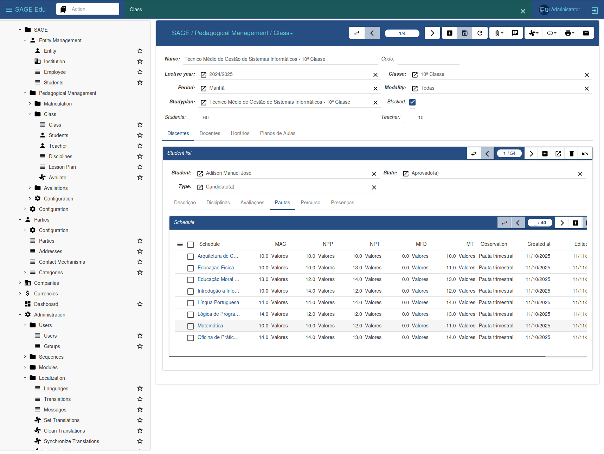

# 🏫 SAGE Education - Institutional Management / ERP

**Version:** 1.2.x  
**Module:** Tryton ERP Version 7.0   
**Developer:** Zacarias Juliano Capingala (FPC)  


---


## 📘 About the Project

**SAGE Education** is a ***free and open-source*** project for ***educators, educational institutions, and governments***.
It provides the functionality of **Academic Management System (AMS), School Management System (SMS), and Educational Information System (EIS)**.
Its ***modular, scalable, and secure*** design allows it to be implemented in many different scenarios: from **small schools** and **training centers** to **large national public education systems**.

SAGE Education has a growing, committed, and friendly community that brings together the best in the fields of ***educational sciences, pedagogy, educational technology, and computer science***.
No matter where in the world you live, we are passionate about upholding education and educational technology as a non-negotiable human right.

We hope you find **SAGE Education** motivating and inspiring, and we look forward to having you as part of the team.


We host a [public demo server](https://sage.comunidadedosaber.ao) where you can try out SAGE Education with different [access profiles](https://docs.comunidadedosaber.ao/guia/demo/).
  




---


## ⚙️ SAGE Education Modules

**🎓 AMS** - Academic Management System

**🏫 SMS** - School Management System

**🏢 EIS** - Educational Information System


### 🌐 Homepage

**Team:** [comunidadedosaber.ao](https://comunidadedosaber.ao)  
**Website:** [sage-edu.comunidadedosaber.ao](https://sage-edu.comunidadedosaber.ao)  
**App:** [sage.comunidadedosaber.ao](https://sage.comunidadedosaber.ao)  
**Docs:** [docs.comunidadedosaber.ao](https://docs.comunidadedosaber.ao)  


---


## 📦 Install SAGE Edu Module

```bash
pip install akademy-party~=1.1.0
pip install akademy-company~=1.1.0
pip install akademy-classe~=1.1.0
pip install akademy-matriculation~=1.1.0
pip install akademy-matriculation-confirmation~=1.1.0
pip install akademy-dashboard~=1.1.0
pip install trytond-currency==7.0.0
pip install trytond-party-avatar==7.0.0
pip install trytond-bank==7.0.0
pip install trytond-company-work-time==7.0.0
pip install trytond-timesheet==7.0.0
pip install trytond-project==7.0.0
pip install proteus==7.0.0
```


---


## 🤝 Contributing

Contributions are welcome!
Please open an issue or submit a pull request following the SAGE Edu contribution guidelines.

[https://github.com/zacariasjuliano/akademy-party](https://github.com/zacariasjuliano/akademy-party)  
[https://github.com/zacariasjuliano/akademy-company](https://github.com/zacariasjuliano/akademy-company)   
[https://github.com/zacariasjuliano/akademy-classe](https://github.com/zacariasjuliano/akademy-classe)   
[https://github.com/zacariasjuliano/akademy-matriculation](https://github.com/zacariasjuliano/akademy-matriculation)   
[https://github.com/zacariasjuliano/akademy-matriculation-confirmation](https://github.com/zacariasjuliano/akademy-matriculation-confirmation)   
[https://github.com/zacariasjuliano/akademy-dashboard](https://github.com/zacariasjuliano/akademy-dashboard)

### 💬 Technical Support

If you encounter any errors or require technical support, please contact us through the channels below:

- 📧 **E-mail:** [suporte@comunidadedosaber.ao](mailto:suporte@comunidadedosaber.ao)  
**E-mail:** [comercial@comunidadedosaber.ao](mailto:comercial@comunidadedosaber.ao)  
- 💬 **WhatsApp:** [+244 955 868 110](https://wa.me/244955868110)

